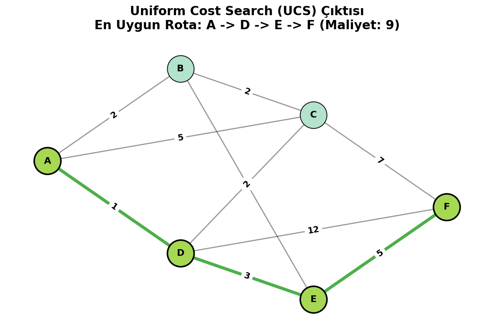
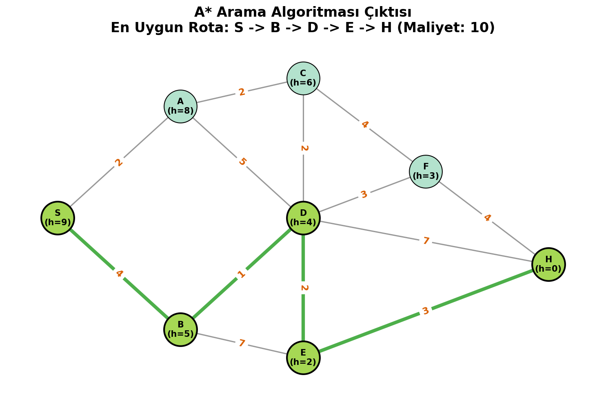

# 🚀 Yapay Zeka Arama Algoritmaları (Search Algorithms)

Bu depo, yapay zeka alanındaki temel arama algoritmalarından **Uniform Cost Search (UCS)** ve **A* Arama (A-Star Search)** algoritmalarının Python ile profesyonel bir şekilde uygulanmasını içermektedir. `YZM0202 Practice 1` şartnamesine tam uyumlu olarak geliştirilmiştir.

## 🎯 Projenin Amacı ve Özellikleri

Proje, ağırlıklı graf (graph) yapıları üzerinde optimum yolu bulmaya çalışan iki farklı günlük hayat senaryosunu çözmektedir.
Geliştirilen algoritmaların en önemli özelliği; öncelikli kuyruk (priority queue) mantığı ve özelleştirilmiş **"Tie-Breaking" (Eşitlik Bozma)** kurallarının kusursuz işletilmesidir. Kapalı/ziyaret edilmiş listeler (`visited`) doğru yönetilerek sonsuz döngü (infinite loop) ihtimalleri sıfırlanmış ve veri yapıları modüler olarak entegre edilmiştir.

---

## 📦 İçerik ve Senaryolar

### 1. Kurye Rota Optimizasyonu (Uniform Cost Search)
- **Dosya:** `ucs_kurye.py`
- **Konu:** Bir bisikletli kuryenin (`A` başlangıç noktası), kampüs içindeki hedefine (`F` teslimat noktası) ulaştıran en düşük maliyetli rotanın hesaplanması.
- **Kural (Tie-Breaking):** Kuyruktaki maliyetler eşit olduğunda alfabetik olarak önceliği olan (daha önde gelen) harf seçilir. Python'un `heapq` modülü, bu davranış için veriyi `(maliyet, dugum, yol)` biçiminde kullanır. Hedef kontrolü her zaman kuyruktan çıkarımda (node expansion limitinde) yapılır.
- **Optimum Maliyet:** 9
- **Optimum Yol:** A -> D -> E -> F



### 2. Sürücü Acil Durum Rotası (A* Search)
- **Dosya:** `astar_acil.py`
- **Konu:** Bir sürücünün trafiğe ve hedefe olan kuş uçuşu mesafesine (sezgisel tahminleri yani `h(n)`) göre başlangıç noktasından (`S`), hastaneye (`H`) olabilecek en hızlı şekilde yetişmesi.
- **Kural (Tie-Breaking):** Toplam tahmini f-maliyeti (`f = g + h`) birbirine eşit olduğunda; *öncelikle* o ana kadar yapılan harcamayı anlatan gerçek g-maliyeti (`g`) en küçük olan tercih edilir. `g` değerleri de aynı denk gelirse, düğüm adının alfabetik düzeni hesaba katılır. Yapı: `(f_degeri, g_degeri, dugum_adi, yol)` 
- **Optimum Maliyet (g):** 10
- **Optimum Yol:** S -> B -> D -> E -> H



---

## 🛠 Kullanılan Teknolojiler
- **Python 3.x**
- **Heapq (Yerleşik Kütüphane):** Arama maliyet sıralamaları ve öncelik yönetimi için
- **NetworkX & Matplotlib:** Sistem üzerine üretilen ağaç hiyerarşisi görsellerinin (`gorsellestir.py` üzerinden) tasarlanması için

## 🚀 Kurulum ve Çalıştırma

Her bir senaryoyu çözmek, tie-breaking mantığını terminal loglarından adım adım inceleyebilmek için uçbirimden ilgili klasörde şu komutları çalıştırmanız yeterlidir:

```bash
# Uniform Cost Search (Kurye) uygulamasını test etmek için:
python ucs_kurye.py

# A* Search (Hastane/Sürücü) uygulamasını test etmek için:
python astar_acil.py

# Arama ağaçlarının .png formatında harita görsellerini sıfırdan üretmek için:
python gorsellestir.py
```

## 📝 Notlar
- Performans sorunlarından kaçınmak adına `visited` olarak nitelenen "kapatılmış dizin" değişkenleri dinamik veri kümesi (set) yapılarıyla denetimde tutulmuştur.
- Koda, genel geliştirme prensipleri ve kod okunabilirliğini ("clean code") maksimize edebilmek adına, Python docstring'leri ve satır içi dökümantasyonlar eklenmiştir.
